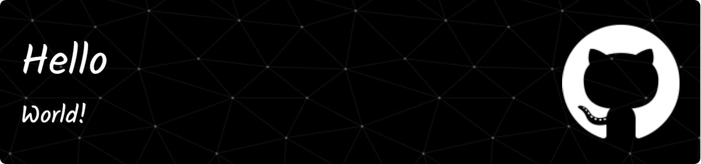

# Hedonism-kr
# 
# 

# Hedonism-kr

[][repo-link]
[][repo-link]

신나는 학생

## 소개

* 내가 할 수 있는거
   
## 사용하는 툴

### Platforms
[][vscode-link]

**Hendonism-kr**

[][Hedonism-kr-gmail]
[][Hedonism-kr-github]

[Hedonism-kr-gmail]: mailto:jebala991@gmail.com
[Hedonism-kr-github]:https://github.com/Hedonism-kr
[repo-link]: https://github.com/Hedonism-kr/Hendonism-kr/tree/main
[vscode-link]: https://code.visualstudio.com/
